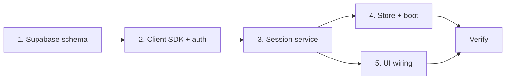

# Phase 2 — Auth & Session Lifecycle

*Implementation map. Contract: `backend-contract.md`. Stack: `backend-decision.md` (Supabase).*

**Goal:** Real identity and real sessions that live on the server, survive app restarts, and can be **ended in a way the server enforces** — not just local UI.

**Size:** M (several weekends, solo)  
**Depends on:** Phase 0 contract + Phase 1 Supabase decision  
**Blocks:** Phase 3 (join) — you need server sessions before anyone can join one

---

## What Phase 2 is (and isn't)

| In scope | Out of scope (later phases) |
|----------|-----------------------------|
| Supabase in the **production** app | Join flow, deep links, second device (Phase 3) |
| Anonymous auth + `users` profile row | Live GPS on session channels (Phase 4) |
| Postgres: `sessions`, `memberships` | Push notifications (Phase 6) |
| `createSession` → real id + server invite code | Declared-status realtime (can stub; full wire Phase 2+ or 5) |
| `endSession` server-enforced + client teardown | Multi-group switcher UI |
| Boot: restore active session from server | Email/OTP auth (optional upgrade path only) |
| RLS so ended sessions are inaccessible | Location history tables (never) |

**Phase 2 is still single-player on the map.** After create, the roster is **host only** (real user). Mock friends / `friendSimulator` can stay behind `__DEV__` for solo map testing until Phase 3 replaces them with a real roster.

---

## Exit criteria (from roadmap)

Verify all of this on **one phone**:

1. Create a session via the wizard → server returns canonical `sessionId` + `inviteCode`
2. Kill and reopen the app → same session loads from the server (not the retint hack)
3. Tap **End Night** → `ended_at` is set in Supabase; client clears active session
4. Try to load that session again → server rejects it (RLS or RPC error)
5. Invite code for that session no longer works (validated in Phase 3, but DB should already mark it dead)

---

## Work streams

Five streams; run **1 → 2 → 3** in order, then **4 + 5** in parallel.



---

### Stream 1 — Supabase schema & policies ✅

Add a `supabase/` folder in ReGroup with migrations (version-controlled from day one).

**Delivered:** `supabase/migrations/20260615120000_phase2_schema.sql` — tables, RLS, `create_session` / `get_session` / `end_session` RPCs. See `supabase/README.md` to apply.

**Tables**

```sql
-- users: extends auth.users
users (
  id          uuid PK → auth.users.id,
  display_name text NOT NULL,
  initials     text NOT NULL,
  created_at   timestamptz DEFAULT now()
)

-- sessions: maps to Session in backend-contract.md
sessions (
  id            uuid PK DEFAULT gen_random_uuid(),
  name          text NOT NULL,
  vibe_key      text,
  invite_code   text NOT NULL UNIQUE,  -- unique among active; see partial index below
  host_user_id  uuid → users.id,
  created_at    timestamptz DEFAULT now(),
  ended_at      timestamptz            -- null = active
)

-- memberships
memberships (
  session_id  uuid → sessions.id,
  user_id     uuid → users.id,
  role        text CHECK (role IN ('host', 'member')),
  joined_at   timestamptz DEFAULT now(),
  left_at     timestamptz,
  PRIMARY KEY (session_id, user_id)
)
```

**Invite code uniqueness (active only)**

```sql
CREATE UNIQUE INDEX sessions_invite_code_active_idx
  ON sessions (invite_code)
  WHERE ended_at IS NULL;
```

**Server-side invite generation** — Postgres function (e.g. `generate_invite_code(name text)`) using the same `XXXX-YYYY` shape as `features/group/data/vibes.ts`. Client preview stays; server is authoritative on create.

**RPCs / mutations** (prefer RPC for atomic create):

| RPC | Who | What |
|-----|-----|------|
| `create_session(name, vibe_key)` | authenticated user | inserts session + host membership + returns session row |
| `end_session(session_id)` | host only | sets `ended_at`, sets `left_at` on open memberships |
| `get_session(session_id)` | member only | returns session + roster snapshot |

`join_session(invite_code)` is **Phase 3** — don't build yet, but design RLS so it's a small add.

**RLS (minimum for Phase 2)**

- `users`: read/update own row only; insert own row on first sign-in
- `sessions`: members can `SELECT` where `ended_at IS NULL`; host can `end_session` via RPC (security definer)
- `memberships`: members can read rows for their sessions
- No table for location — ever

**Trigger:** `auth.users` insert → create `users` row with defaults (`display_name: 'You'`, `initials: 'YOU'`) or upsert from client after wizard.

---

### Stream 2 — Client SDK & auth layer ✅

**Delivered:** `@supabase/supabase-js`, `@react-native-async-storage/async-storage`, `lib/supabase.ts`, `services/authService.ts`, `providers/AuthProvider.tsx`, `.env.example`. Boot: anonymous sign-in + `ensure_user_profile` before routes mount.

---

### Stream 3 — Session service ✅

**Delivered:** `services/sessionService.ts` — `createSession`, `getSession`, `endSession`, `attachSessionControl`, `leaveSessionChannel`, `onSessionEnded`. Maps RPC payloads → `Group`; broadcasts `session_ended` on `session:{id}:control`.

---

### Stream 4 — Store, persistence & boot ✅

**Delivered:** `lib/sessionStorage.ts`, `useGroupStore` with `createGroup` → server, `restoreActiveSession`, `endSession`, `handleRemoteSessionEnded`; boot in `AuthProvider`; `useLiveFriends` skips simulator when `hasActiveSession`; wizard awaits async `createGroup`.

---

### Stream 5 — UI wiring ✅

**Delivered:** `end_night` → `endSession`; wizard loading/error states; invite preview in wizard; server invite in `GroupSheet`; `rosterLabel` from `group.vibe`; mock idle documented.

**Phase 2 complete.**

---

---

## Recommended build order

| Step | Task | Verify |
|------|------|--------|
| 1 | Supabase migrations + RLS + RPCs | SQL editor: create/end/get manually |
| 2 | `lib/supabase.ts` + env + anonymous auth | User appears in Auth + `users` table |
| 3 | `sessionService.createSession` | Wizard creates row in `sessions` + `memberships` |
| 4 | `useGroupStore.createGroup` swap | Home shows server id + invite code |
| 5 | AsyncStorage + `loadActiveSession` | Kill app → session restores |
| 6 | `endSession` RPC + store + HomeScreen | `ended_at` set; reload fails |
| 7 | Realtime `session_ended` broadcast (spike port) | Ready for Phase 3; optional single-device log |

---

## Client ↔ server seam (protect this)

```
CreateGroupScreen
  → useGroupStore.createGroup
    → sessionService.createSession
      → supabase.rpc('create_session')
        → returns Session
      → map to Group
    → setActive + persist sessionId

HomeScreen end_night
  → useGroupStore.endSession
    → sessionService.endSession
      → supabase.rpc('end_session')
      → broadcast session_ended
      → clear store + storage
```

Components (`MapCanvas`, `QuickActions`, `InviteCard`) **do not change shape** — only the store's data source changes. That's the Phase 0 contract paying off.

---

## Risks & guardrails

| Risk | Guardrail |
|------|-----------|
| Scope creep into join flow | No `join_session`, no deep-link handler, no Phase 3 routes |
| Scope creep into live location | No changes to `locationService` / `useLiveFriends` yet |
| Mock + real data fighting | Real session → real roster (host only); simulator off when `active.id` is server uuid |
| RLS holes on ended sessions | Test: ended session returns nothing to members; invite index allows code reuse after end |
| Anonymous abuse | Rate-limit RPCs later; fine for dev/beta |

---

## Phase 2 vs Phase 3 boundary

| Phase 2 delivers | Phase 3 adds |
|------------------|--------------|
| Session exists server-side | Second device joins via code/link |
| Host-only roster | Live roster sync |
| Server invite code | `regroup://join/{code}` handler |
| `endSession` enforced | Presence: member joined/left |
| Boot restores session | Device B appears on Device A |

**Phase 3 is the momentum milestone** — but Phase 2 is the backbone. Without server-enforced `ended_at`, the privacy promise is still marketing copy.

---

## Suggested first PR slice

Smallest shippable increment:

1. `supabase/migrations/001_sessions.sql`
2. `lib/supabase.ts` + `services/authService.ts`
3. `services/sessionService.ts` with `createSession` only
4. Wire `group/new.tsx` + store

You get a real session in the DB before tackling boot persistence and end — easier to debug.
