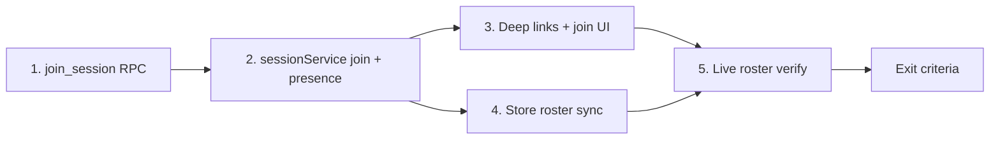

# Phase 3 — Join Flow

*Implementation map. Builds on Phase 2 (`phase-2.md`). Contract: `backend-contract.md`.*

**Goal:** A second person actually joins your session. Device B taps the link or enters the code and appears on Device A's roster — live.

**Size:** M (several weekends, solo)  
**Depends on:** Phase 2 complete (auth, sessions, `create_session` / `get_session` / `end_session`)  
**Blocks:** Phase 4 (live location needs a real roster to receive fixes)

---

## What Phase 3 is (and isn't)

| In scope | Out of scope (later phases) |
|----------|-----------------------------|
| `join_session` RPC + invite validation | Live GPS on map (Phase 4) |
| Deep link `regroup://join/{code}` | Push notifications (Phase 6) |
| Join screen + manual code entry | QR scanner (Phase 7) |
| Live roster sync host ↔ joiner | Declared-status realtime (Phase 5) |
| Supabase Realtime presence / broadcast for `joined` | Display-name onboarding flow (optional lite) |
| Device B persists joined session on boot | Multi-session switcher UI |
| Map shows real members in list (static pins OK) | Proximity from real GPS |

**Phase 3 proves multiplayer exists.** Friends appear in the sheet and on the map at default positions. They do not move until Phase 4 wires location broadcast.

---

## Exit criteria (from roadmap)

On **two real phones**:

1. Phone A creates a session → shares invite link or code
2. Phone B opens `regroup://join/BKLY-7G3X` (or enters code manually) → joins
3. Phone B lands on the home map in that session
4. Phone A's friend list updates **without refresh** — B appears as a new row
5. Kill and reopen Phone B → still in the same session
6. Invalid / ended codes show a clear error (no silent failure)

**Celebrate this one.** It's the line between prototype and product.

---

## Current gaps (as of Phase 2 complete)

| Piece | Status |
|-------|--------|
| `app.json` scheme `regroup` | ✅ configured |
| `InviteCard` shares `regroup://join/{code}` | ✅ |
| `app/(modals)/join/[code].tsx` | ✅ |
| `JoinSessionScreen` + `/join` manual entry | ✅ |
| `useDeepLinkJoin` + `DeepLinkHandler` | ✅ |
| `join_session` RPC | ✅ `20260615130000_join_session.sql` |
| `sessionService.joinSession` | ✅ |
| `attachSessionPresence` + `roster_updated` | ✅ |
| `useGroupStore.joinSession` | ✅ |
| Live roster → store sync | ✅ |

---

## Work streams

Five streams; run **1 → 2 → 3**, then **4 + 5** in parallel.



---

### Stream 1 — `join_session` RPC

**Migration:** `supabase/migrations/20260615130000_join_session.sql`

```sql
create or replace function public.join_session(p_invite_code text)
returns jsonb
language plpgsql
security definer
set search_path = public
as $$
declare
  v_user_id uuid := auth.uid();
  v_session public.sessions;
  v_code text := upper(trim(p_invite_code));
begin
  if v_user_id is null then
    raise exception 'Not authenticated';
  end if;

  if v_code = '' then
    raise exception 'Invite code is required';
  end if;

  perform public.ensure_user_profile();

  select * into v_session
  from public.sessions
  where invite_code = v_code
    and ended_at is null;

  if not found then
    raise exception 'Invalid or expired invite code';
  end if;

  -- Idempotent re-join: already a member with open membership
  if exists (
    select 1 from public.memberships m
    where m.session_id = v_session.id
      and m.user_id = v_user_id
      and m.left_at is null
  ) then
    return public.build_session_payload(v_session.id);
  end if;

  insert into public.memberships (session_id, user_id, role)
  values (v_session.id, v_user_id, 'member');

  return public.build_session_payload(v_session.id);
end;
$$;

grant execute on function public.join_session(text) to authenticated;
```

**Error cases to test in SQL:**

| Input | Expected |
|-------|----------|
| Valid code, new user | membership row + full roster payload |
| Same user joins again | idempotent — returns roster, no duplicate PK |
| Ended session code | `Invalid or expired invite code` |
| Garbage code | `Invalid or expired invite code` |
| User already host of session | returns roster (already member) |

No new tables. RLS unchanged — writes go through security-definer RPC.

---

### Stream 2 — Session service: join + presence

**Extend `services/sessionService.ts`:**

```typescript
joinSession(inviteCode: string): Promise<Group>
attachSessionPresence(sessionId: string): Promise<void>
leaveSessionPresence(): Promise<void>
onRosterChanged(handler: (group: Group) => void): void
```

**Join flow (client):**

```
joinSession(code)
  → supabase.rpc('join_session', { p_invite_code })
  → payloadToGroup(...)
  → attachSessionControl(sessionId)   // existing
  → attachSessionPresence(sessionId)  // new
  → broadcast member_joined (optional nudge — see below)
  → return Group
```

**Live roster — pick one pattern (recommend A for Phase 3):**

**A) Broadcast on control channel (extends Phase 2 spike)**

Channel: `session:{sessionId}:control` (already used for `session_ended`)

| Event | Payload | When |
|-------|---------|------|
| `session_ended` | `{ endedBy, timestamp }` | existing |
| `roster_updated` | `{ sessionId, members[], timestamp }` | after join / leave |

On `roster_updated`, clients call `get_session` or merge `members[]` directly into store.

**B) Supabase Realtime Presence**

Channel: `session:{sessionId}:presence` per `backend-contract.md`

Track `{ userId, name, initials }` on join; subscribe to `sync` / `join` / `leave` events.

**Recommendation:** Start with **A** (`roster_updated` broadcast) — matches spike patterns, minimal new concepts. Add Presence in Phase 4 if needed for leave detection.

**After `join_session` succeeds, joiner broadcasts:**

```typescript
await channel.send({
  type: 'broadcast',
  event: 'roster_updated',
  payload: { sessionId, timestamp: Date.now() },
});
```

**Host (already on control channel) receives → refetches:**

```typescript
const group = await getSession(sessionId);
onRosterChanged(group);
```

Simple, reliable, one round-trip. Slight latency (~200 ms) is fine for join.

---

### Stream 3 — Deep links + join UI

**New files:**

| File | Responsibility |
|------|----------------|
| `lib/deepLinks.ts` | Parse `regroup://join/BKLY-7G3X` → invite code |
| `app/(modals)/join/[code].tsx` | Route handler |
| `features/group/screens/JoinSessionScreen.tsx` | Confirm + join UI |
| `hooks/useDeepLinkJoin.ts` | Cold-start + warm URL handling |

**`app.json`** — already has `"scheme": "regroup"`. No change unless universal links needed later.

**Deep link parsing:**

```typescript
// regroup://join/BKLY-7G3X
// regroup://join/BKLY-7G3X?...
export function parseJoinDeepLink(url: string): string | null
```

Normalize: uppercase code, strip whitespace.

**Wire in `AuthProvider` or `app/_layout.tsx`** (after auth boot):

```
ensureSignedIn()
  → restoreActiveSession()
  → handlePendingDeepLink()   // new
  → ready
```

If URL is `regroup://join/{code}`:
- If no active session → navigate to `/join/{code}`
- If already in *same* session → ignore
- If already in *different* session → show "Leave current night?" (minimal alert) or block with message

**Join screen UX (minimal):**

- Show invite code (from route param)
- **Join night** button → `useGroupStore.joinSession(code)`
- Loading + error states (mirror create wizard)
- On success → `router.replace('/(tabs)')`
- Optional: show session name from payload after join

**Manual join entry** (no link):

- Add **Join with code** entry on idle home (when `!hasActiveSession`)
- Could be a simple modal or route `/join` with TextInput
- Same `joinSession` path

---

### Stream 4 — Store roster sync

**Extend `store/useGroupStore.ts`:**

```typescript
joinSession(inviteCode: string): Promise<void>
applyGroupSnapshot(group: Group): void   // internal / from presence
```

**`joinSession`:**

```typescript
joinSession: async (inviteCode) => {
  const group = await joinSessionOnServer(inviteCode);
  await persistActiveSessionId(group.id);
  set({ active: group, hasActiveSession: true });
}
```

**Roster live updates (host + all members):**

Register in `sessionService.onRosterChanged`:

```typescript
onRosterChanged((group) => {
  const { hasActiveSession, active } = useGroupStore.getState();
  if (!hasActiveSession || active.id !== group.id) return;
  useGroupStore.setState({ active: group });
});
```

Call `attachSessionPresence` from:
- `createSession` (host)
- `getSession` / `restoreActiveSession`
- `joinSession` (member)

On `endSession` / `handleRemoteSessionEnded`: `leaveSessionPresence()` (already leaves control channel).

**Member list on map:**

`HomeScreen` already passes `group.members` to `useLiveFriends`. With `hasActiveSession`, simulator is off — members render at default `{ x: 0.5, y: 0.5 }` until Phase 4. That's OK for Phase 3 exit (roster in sheet matters most).

**`TopBar` roster label:** `group.vibe` already says `"2 people"` when two members — server `build_session_payload` counts all memberships.

---

### Stream 5 — End-to-end verification + polish

| Check | How |
|-------|-----|
| Share link opens app | iMessage → tap link on Phone B |
| Manual code | Type code on join screen |
| Live roster | A sees B appear in sheet without pull-to-refresh |
| Boot persistence | B kill/reopen → same session |
| Ended session | Host ends → B gets `session_ended` (Phase 2) + roster clears |
| Invalid code | Clear error message |
| Idempotent join | B taps link twice → no crash |

**InviteCard:** enable share on home (not preview) when `hasActiveSession` — use server `group.inviteCode`.

---

## Recommended build order

| Step | Task | Verify |
|------|------|--------|
| 1 | `join_session` migration | SQL: join with valid code |
| 2 | `sessionService.joinSession` | RPC from dev console / temp button |
| 3 | `useGroupStore.joinSession` | Store updates, session persisted |
| 4 | `roster_updated` broadcast + handler | Two simulators or log on host |
| 5 | `JoinSessionScreen` + `/join/[code]` route | Manual navigation works |
| 6 | Deep link handler | Share link opens join |
| 7 | Two-phone test | Exit criteria |

**Smallest first PR:** migration + `joinSession` service + store (test via temporary dev button). Add UI + deep links second PR.

---

## Client ↔ server seam

```
InviteCard share
  → regroup://join/BKLY-7G3X

Phone B opens link
  → parseJoinDeepLink
  → JoinSessionScreen
  → useGroupStore.joinSession(code)
    → sessionService.joinSession
      → rpc('join_session')
      → attachSessionControl + attachSessionPresence
      → broadcast roster_updated
    → persistActiveSessionId
    → setActive(group)

Phone A (host, subscribed)
  → receives roster_updated
  → getSession(sessionId)
  → store.applyGroupSnapshot
  → GroupSheet shows new FriendRow
```

Components (`FriendRow`, `GroupSheet`, `MapCanvas`) **keep their shapes** — only `group.members[]` changes.

---

## Phase 3 vs Phase 4 boundary

| Phase 3 delivers | Phase 4 adds |
|------------------|--------------|
| Second device in session | GPS fixes on `session:{id}:locations` |
| Live roster in sheet | Pins move on map |
| Join via link/code | Proximity status from real distance |
| `friendSimulator` off when session active | `expo-battery` on wire |
| Static member positions on map | Adaptive map span |

**Do not** wire `locationService` broadcast in Phase 3 — it obscures whether join or location is broken during testing.

---

## Risks & guardrails

| Risk | Guardrail |
|------|-----------|
| Deep links don't open in Expo Go | Test with `npx uri-scheme open regroup://join/CODE --ios`; document dev workflow |
| Roster race (join before host subscribes) | Joiner refetches own roster; host refetches on `roster_updated`; idempotent `get_session` |
| B joins while A on mock idle | Only share invite when `hasActiveSession` |
| Display names all "You" | Acceptable for Phase 3; optional name field on join screen if quick |
| Scope creep into GPS | No changes to `locationService` / location channels |

---

## Optional stretch (only if core exit met)

- **Join preview RPC** — `lookup_invite_code(code)` returns `{ name, memberCount }` before confirm (no membership yet)
- **Supabase Presence** on `session:{id}:presence` instead of broadcast refetch
- **Leave session** (member, non-host) — `leave_session` RPC; host-only end stays as-is

---

## Suggested first PR slice

1. `supabase/migrations/20260615130000_join_session.sql`
2. `sessionService.joinSession` + `roster_updated` handler
3. `useGroupStore.joinSession`
4. Temporary dev button on home: "Join test" with hardcoded code

Prove two devices in one session via logs before building the join screen.
