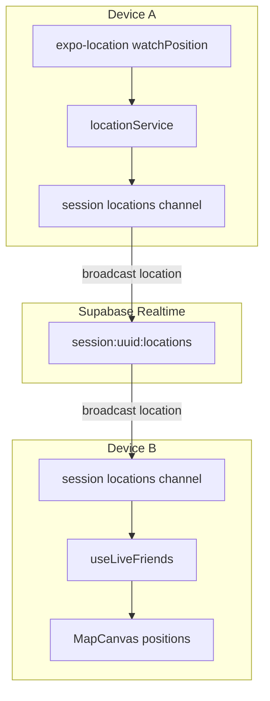
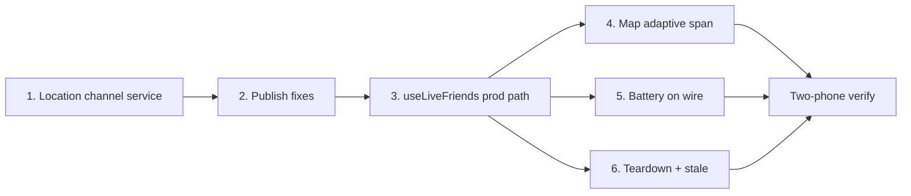

# Phase 4 — Live Location Sharing

*Implementation map. Builds on Phase 3 (`phase-3.md`). Contract: `backend-contract.md`, proximity: `proximity-model.md`.*

**Goal:** Real per-device GPS flowing to every member in real time. Pins move on the map; proximity status and awareness events come from genuine distance — not mock data or static `{ x: 0.5, y: 0.5 }` placeholders.

**Size:** L (several weeks, solo)  
**Depends on:** Phase 3 complete (multiplayer roster, session channels, join/end lifecycle)  
**Blocks:** Phase 5 (ReGroup Action needs real fixes for rally points and navigation)

---

## What Phase 4 is (and isn't)

| In scope | Out of scope (later phases) |
|----------|-----------------------------|
| Broadcast GPS fixes on `session:{id}:locations` | Push notifications (Phase 6) |
| Subscribe + merge friend fixes in `useLiveFriends` | Declared-status realtime (Phase 5) |
| Proximity bands from real Haversine distance | Group-centroid proximity anchor (optional stretch) |
| Adaptive map span / auto-fit for festival scale | Real map tiles (MapKit / Mapbox — Phase 5d decision) |
| Per-device battery % on the wire | Background location upload (Phase 6) |
| Stale-fix detection → awareness transitions | Location history tables (never) |
| Teardown location channel on `end_session` | Adaptive GPS power ramping (Phase 6) |
| Keep `friendSimulator` for solo `__DEV__` idle | Pin clustering at 20+ members (optional stretch) |

**Phase 4 is the core product.** Phase 3 proved two phones share a roster. Phase 4 proves they share *where they are*.

---

## Exit criteria (from roadmap)

On **two real phones** in the same active session:

1. Both grant foreground location permission
2. Phone A walks ~50 m — Phone B's pin moves on the map within ~5 s
3. Walk apart past proximity thresholds — status text changes (`with_group` → `nearby` → `drifting` → `separated`)
4. `AwarenessBanner` fires on a genuine proximity transition (not dev simulator)
5. Friend detail shows real battery % from Phone B's device (not `100` mock)
6. Host taps **End Night** — location broadcast stops; no further fixes received
7. No location rows in Postgres (ephemeral channel only)

---

## Current gaps (as of Phase 3 complete)

| Piece | Status |
|-------|--------|
| `locationService.startWatching()` local GPS | ✅ works |
| `locationService` realtime broadcast | ✅ via `sessionLocationService` |
| `session:{id}:locations` channel | ✅ `sessionLocationService` |
| `useLiveFriends` production path | ✅ |
| `friendSimulator` | ✅ `__DEV__` only when `!hasActiveSession` |
| `mapProjection` span | ✅ adaptive `updateSpanForLocations` |
| `expo-battery` | ✅ |
| Friend `batteryPercent` on wire | ✅ in `LocationUpdate` |
| `awarenessEngine` with real fixes | ✅ via `useAwarenessLoop` + teardown |
| Session teardown order | ✅ `lib/sessionTeardown.ts` |
| Phase 1 spike reference | ✅ `regroup-realtime-spike/App.tsx` — broadcast pattern proven |

---

## Architecture



**Pattern:** Same as Phase 1 spike + Phase 3 control channel — **Supabase Realtime broadcast**, no Postgres writes.

**Channels per active session:**

| Channel | Events | Phase |
|---------|--------|-------|
| `session:{id}:control` | `session_ended`, `roster_updated` | 2–3 ✅ |
| `session:{id}:locations` | `location` (+ optional `battery`) | 4 |

---

## Work streams

Six streams. Run **1 → 2 → 3** in order, then **4 + 5 + 6** in parallel.



---

### Stream 1 — Session location channel

**New file:** `services/sessionLocationService.ts`

Mirror the Phase 3 `sessionService` control-channel pattern for locations.

```typescript
export function sessionLocationChannel(sessionId: string): string
export async function attachSessionLocations(sessionId: string): Promise<void>
export async function leaveSessionLocations(): Promise<void>
export function onFriendLocation(handler: (update: LocationUpdate) => void): void
export async function broadcastLocation(update: LocationUpdate): Promise<void>
```

**Wire shape** (from `backend-contract.md`):

```typescript
type LocationUpdate = {
  sessionId: string;
  userId: string;
  location: DeviceLocation;
  batteryPercent?: number;  // Phase 4 extension — optional on wire
};
```

**Broadcast event name:** `location` (matches Phase 1 spike).

**Subscribe handler:**

```typescript
channel.on('broadcast', { event: 'location' }, ({ payload }) => {
  const update = payload as LocationUpdate;
  if (update.sessionId !== activeSessionId) return;
  if (update.userId === currentUserId) return; // ignore own echo
  locationHandler?.(update);
});
```

**No migration required.** Location is ephemeral — Realtime only.

**Attach from** (same places as `attachSessionPresence`):

- `createSession` / `getSession` / `joinSession` in `sessionService.ts`
- Or a single `attachSessionRealtime(sessionId)` wrapper that calls control + locations

**Leave on:**

- `endSession` / `handleRemoteSessionEnded` / `leaveSessionChannel`

---

### Stream 2 — Publish local fixes

**Extend `services/locationService.ts`:**

Today `startWatching()` notifies local subscribers only. Phase 4 adds an optional publish callback wired by `sessionLocationService` when a session is active.

```typescript
// Option A — sessionLocationService subscribes to locationService
locationService.subscribe((fix) => {
  if (!activeSessionId) return;
  void broadcastLocation({
    sessionId: activeSessionId,
    userId: currentUserId,
    location: fix,
    batteryPercent: latestBattery,
  });
});
```

**Cadence** (already configured — do not change without reason):

```typescript
{
  accuracy: Location.Accuracy.Balanced,
  distanceInterval: 5,   // meters
  timeInterval: 3000,    // ms
}
```

**Guardrails:**

- Do not broadcast when `!hasActiveSession`
- Do not broadcast after `session_ended` (set `sessionActiveRef = false` before channel teardown — spike pattern)
- Include `location.timestamp` on every fix for stale detection

**Permission UX:** `useLocation` already requests foreground permission on mount. If denied, show existing `LocationDebugCard` error in `__DEV__`; production needs a user-visible banner (minimal alert or sheet row).

---

### Stream 3 — `useLiveFriends` production path

**File:** `hooks/useLiveFriends.ts`

Today when `hasActiveSession` is true, the hook returns static `friend.position` defaults — pins sit at map centre.

**Target logic:**

```
if (!userLocation) → static positions (unchanged)

if (hasActiveSession) {
  subscribe onFriendLocation → merge into friendLocations state
  run proximityEngine + mapProjection per friend
  return live friends + positions
}

if (__DEV__ && !hasActiveSession) {
  friendSimulator path (unchanged)
}
```

**Per-friend pipeline** (already implemented for simulator path — reuse):

```
DeviceLocation
  → mapProjection.projectFromOrigin(friendFix)
  → relativeToUser(projected, userMapPosition)   // MapCanvas
  → computeFriendProximity(user, friend)
  → mergeDisplayStatus(...)
  → Friend with position, status, distanceFromUserMiles
```

**Stale fixes:** If `Date.now() - location.timestamp > STALE_MS`, degrade status or mark `lastSeenMinutesAgo` — wire `awarenessEngine` stale path (`STATUS_THRESHOLDS.staleMinutes` in `statusEngine.ts`).

**Reset on session end:** Clear `friendLocations` state; call `mapProjection.reset()` so the next session gets a fresh origin.

---

### Stream 4 — Map scale (adaptive span)

**File:** `services/mapProjection.ts`

**Problem:** `spanMeters: 1500` clamps anyone past ~750 m to the screen edge. Useless at festivals, theme parks, or bar crawls across a neighborhood.

**Minimum viable fix:**

1. Compute bounding box of all known GPS fixes (user + friends)
2. Set `spanMeters = max(1500, diagonalMeters * 1.4)` with a ceiling (e.g. 5 km)
3. Re-project all pins when span changes (smooth optional — snap is fine for v1)

```typescript
function computeAdaptiveSpanMeters(
  user: DeviceLocation,
  friends: Record<string, DeviceLocation>,
): number {
  // haversine max extent + padding
  return Math.min(5000, Math.max(1500, extent * 1.4));
}
```

**API sketch:**

```typescript
mapProjection.setSpanMeters(span: number): void
mapProjection.reset(): void  // existing — call on session end
```

**MapCanvas / pan-zoom:** Not required for exit criteria. Auto-fit span is enough for two-phone test. Pinch-zoom or auto-frame animation is optional stretch.

**Centroid projection** (`proximity-model.md` deferred item): optional stretch — user-relative proximity stays locked for v1. Do not switch proximity anchor unless explicitly tested.

---

### Stream 5 — Battery reporting

**Dependency:** `npx expo install expo-battery`

**New helper:** `services/batteryService.ts` (or inline in location publish)

```typescript
export async function getBatteryPercent(): Promise<number>
```

Poll every 60 s or piggyback on location broadcast (every 3 s is fine for Phase 4 — optimize in Phase 6).

**Wire:** Include `batteryPercent` in `LocationUpdate` broadcast payload.

**Receive path:** `useLiveFriends` merges incoming `batteryPercent` onto `Friend.batteryPercent`.

**Remove mock path in session:** Stop calling `awarenessDevSimulator.getBatteryPercent` when `hasActiveSession`.

**Self battery:** Update `group.user.batteryPercent` from local `expo-battery` for `FriendRow` self row.

---

### Stream 6 — Lifecycle, teardown, awareness

**Session attach** (`sessionService.ts` or store):

After `attachSessionPresence`, call `attachSessionLocations(sessionId)` and register `locationService` publish.

**Session end** (`useGroupStore.endSession` / `handleRemoteSessionEnded`):

```
leaveSessionLocations()
locationService.stopWatching()  // only if no other consumers — or keep watching for map self
mapProjection.reset()
clear friendLocations in useLiveFriends (automatic via channel leave + state reset)
```

**Order matters** (spike lesson): set `sessionActive = false` **before** removing channel so in-flight GPS callbacks don't broadcast after end.

**Awareness:** `useAwarenessLoop` already consumes `friendLocations` — once Stream 3 delivers real fixes, proximity transitions and `battery_low` events fire naturally. Verify with a real walk test.

---

## Client ↔ server seam

```
Phone A (walking)
  → locationService.watchPosition (3 s)
  → sessionLocationService.broadcastLocation
  → session:{id}:locations broadcast

Phone B (map)
  → onFriendLocation(update)
  → useLiveFriends merges friendLocations
  → mapProjection.projectFromOrigin
  → MapCanvas positions[userId] moves
  → proximityEngine → Friend.status updates
  → awarenessEngine → AwarenessBanner on transition
```

Components (`MapCanvas`, `FriendRow`, `GroupSheet`, `AwarenessBanner`) **keep their shapes** — only `positions` and friend fields change.

---

## Recommended build order

| Step | Task | Verify |
|------|------|--------|
| 1 | `sessionLocationService` subscribe + log | Two devices on channel, log incoming payloads |
| 2 | Wire `locationService` → broadcast when session active | Phone A logs `sent location` |
| 3 | `useLiveFriends` production merge | Phone B `friendLocations` populates |
| 4 | Pins move on map | Walk test — visual |
| 5 | Proximity status changes | Walk apart — status text |
| 6 | Adaptive span | Walk 200 m+ — pin not clamped to edge |
| 7 | `expo-battery` on wire | Friend detail shows real % |
| 8 | End session teardown | No fixes after end |
| 9 | Awareness transition | Banner on drift |

**Smallest first PR:** Streams 1–3 only (broadcast + receive + pins move). Map span and battery as follow-up PRs.

---

## Phase 4 vs Phase 5 boundary

| Phase 4 delivers | Phase 5 adds |
|------------------|--------------|
| Raw GPS on wire | Declared status broadcast (`session:{id}:declared`) |
| User-relative proximity | ReGroup Action — rally point, response states |
| Stylized map with moving pins | Meet Me Here + navigation arrow |
| Real battery % | Coordination status vocabulary |
| Awareness from real transitions | Push notifications for regroup |

**Do not** build rally points, custom map pins, or coordination UI in Phase 4 — scope creep into the differentiator before the core loop is solid.

**Map tiles decision** (Phase 5d): Phase 4 keeps `MapAtmosphere` / `MapPaths` decorative canvas. Dropping named pins on a geographic map requires MapKit or Mapbox — decide during Phase 4 map work, implement UI in Phase 5.

---

## Risks & guardrails

| Risk | Guardrail |
|------|-----------|
| Location works but join broke | Phase 3 exit criteria must stay green — test join before location PR merges |
| Pins jump wildly | Require `timestamp`; ignore fixes older than last seen; smooth optional |
| Expo Go backgrounding stops GPS | Foreground-only for Phase 4 — document; Phase 6 handles background |
| Battery drain | 3 s cadence is intentional for testing; Phase 6 adds adaptive ramping |
| Echo own broadcasts | Filter `userId === auth.uid()` on receive |
| Span thrashing as friends move | Debounce span recalc (e.g. max once per 10 s) |
| Permission denied on Phone B | Clear error state; don't silently show static pins as "live" |
| Simulator has no GPS | Two **physical phones** for exit criteria |

---

## Reference: Phase 1 spike

`DevSpikes/regroup-realtime-spike/App.tsx` — proven patterns:

- `watchPositionAsync` with same intervals as production
- `channel.send({ type: 'broadcast', event: 'location', payload })`
- `sessionActiveRef` guard before send
- Teardown: stop GPS → remove channel → clear state

Port spike logic into `sessionLocationService` + `locationService` — do not modify the spike repo for production work.

---

## Optional stretch (only if exit criteria met)

- **Smooth pin interpolation** — lerp between fixes for visual polish
- **Centroid-relative proximity toggle** — `proximity-model.md` migration path
- **Pin clustering** — when `members.length > 8`
- **Location debug overlay** — production-safe latency ms (spike had this)
- **Separate `battery` broadcast event** — if piggybacking bloats payload

---

## Suggested first PR slice

1. `services/sessionLocationService.ts` — attach, broadcast, subscribe
2. Wire publish from `locationService` when `hasActiveSession`
3. `useLiveFriends` production path (pins move)
4. Attach/detach in `sessionService` lifecycle

Prove two phones see pins move before adaptive span or battery.

---

## File touch list

| File | Change |
|------|--------|
| `services/sessionLocationService.ts` | **new** — channel attach, broadcast, subscribe |
| `services/locationService.ts` | publish hook when session active |
| `services/mapProjection.ts` | adaptive `spanMeters`, `setSpanMeters` |
| `services/batteryService.ts` | **new** — `expo-battery` wrapper |
| `hooks/useLiveFriends.ts` | production path when `hasActiveSession` |
| `services/sessionService.ts` | attach/leave location channel with session |
| `store/useGroupStore.ts` | `mapProjection.reset()` on session end |
| `package.json` | `expo-battery` |
| `types/location.ts` | optional `LocationUpdate` type export |

No changes to `MapCanvas`, `FriendRow`, or `AwarenessBanner` if data shapes hold.

---

## Related docs

- [`backend-contract.md`](./backend-contract.md) — `LocationUpdate`, channel names
- [`proximity-model.md`](./proximity-model.md) — user-relative v1, centroid deferred
- [`phase-3.md`](./phase-3.md) — multiplayer roster (complete)
- [`../ReGroup-Roadmap.md`](../ReGroup-Roadmap.md) — Phase 5 preview
