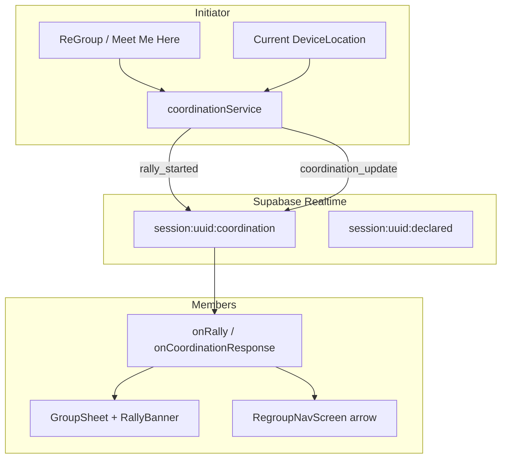
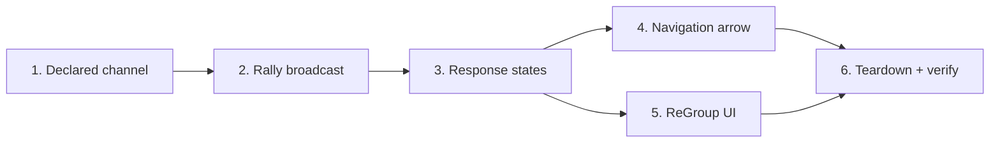

# Phase 5 — ReGroup Action

*Implementation map. Builds on Phase 4 (`phase-4.md`). Contract: `backend-contract.md`, status: `types/status.ts`.*

**Goal:** The verb. Any member can call a regroup — broadcast a rally point, crew responds with structured states, initiator sees who's coming. Coordination layered on awareness, not a second map app.

**Size:** L (several weeks, solo)  
**Depends on:** Phase 4 complete (live GPS, proximity, session channels)  
**Blocks:** Phase 6 (push/background makes regroup alerts reliable when app is backgrounded)

---

## What Phase 5 is (and isn't)

| In scope | Out of scope (later phases) |
|----------|-----------------------------|
| **Meet Me Here** — broadcast current GPS as rally point | Push notifications when backgrounded (Phase 6 — in-app alert OK for exit) |
| **Response states** — `at_meeting_point` / `heading_to_point` / `cant_make_it` / `no_response` | Background location ramping (Phase 6) |
| **Navigation arrow** — bearing + distance via `geo.ts` | Full turn-by-turn directions |
| Declared status on `session:{id}:declared` (`im_good`, `heading_home`) | Permanent friend graph |
| ReGroup as primary session action (FAB or sheet CTA) | Custom named pins on geographic map (5d — needs MapKit/Mapbox) |
| Ephemeral rally state — cleared on `end_session` | **Last Together** history (5e — ship last, high risk) |
| `mergeDisplayStatus` — coordination > declared > proximity | Location history tables (never) |

**Phase 5 is the differentiator.** Phase 4 answers "where is everyone?" Phase 5 answers "get the crew back together."

---

## Exit criteria (from roadmap)

On **two+ real phones** in an active session:

1. Member A taps **ReGroup** / **Meet Me Here** → rally point broadcasts to the session
2. Member B sees an in-app alert / banner — rally is active, who called it
3. B taps a response: **Heading there** / **Can't make it** (or arrives → **At point**)
4. A's UI shows live response chips for each member — including **No response** after timeout
5. B opens navigation → in-app bearing + distance arrow updates as they walk
6. Host **End Night** → rally state clears for everyone (no stale rally after session end)

**Push notifications** are Phase 6. Foreground in-app notification is enough for Phase 5 exit.

---

## Current gaps (as of Phase 4 complete)

| Piece | Status |
|-------|--------|
| `CoordinationStatus` types + `mergeDisplayStatus` | ✅ `types/status.ts` |
| `Friend.coordinationStatus` field | ✅ |
| `bearingDegrees` + distance helpers | ✅ `services/geo.ts` |
| Live GPS + session channels | ✅ Phase 4 |
| `QuickActions` (`im_good`, `heading_home`, `end_night`) | ✅ UI only |
| Declared status broadcast | ✅ `sessionDeclaredService` |
| Rally point model + channel | ✅ `coordinationService` |
| Coordination response broadcast | ❌ missing |
| ReGroup / Meet Me Here CTA | ✅ FAB → `startRally` when session active |
| Response UI on roster / sheet | ❌ missing |
| Navigation arrow screen | ❌ missing |
| `no_response` timeout logic | ❌ missing |
| Custom map pin (5d) | ❌ blocked — decorative canvas only |
| Last Together (5e) | ❌ deferred |

---

## Status vocabulary (locked — do not fork)

From `types/status.ts` — **one system**, three layers:

```typescript
// Display precedence: coordination > declared > proximity
type CoordinationStatus =
  | 'at_meeting_point'
  | 'heading_to_point'
  | 'cant_make_it'
  | 'no_response';

type DeclaredStatus = 'im_good' | 'heading_home' | 'home_safe';
type ProximityStatus = 'with_group' | 'nearby' | 'drifting' | 'separated';
```

| Source | Channel | Phase |
|--------|---------|-------|
| Proximity | computed client-side | 4 ✅ |
| Declared | `session:{id}:declared` | 5 Stream 1 ✅ |
| Coordination | `session:{id}:coordination` | 5 Stream 2 ✅ |
| Rally point | `session:{id}:coordination` | 5 Stream 2 ✅ |

---

## Architecture



**Pattern:** Same as locations — **Supabase Realtime broadcast**, no Postgres. Rally state lives in memory + optional `useCoordinationStore` (Zustand). Purge on `end_session` via `resetLiveSessionClientState` extension.

---

## Work streams

Six streams. Build **1 → 2 → 3**, then **4 + 5** in parallel, then **6**.



---

### Stream 1 — Declared status channel

**New file:** `services/sessionDeclaredService.ts` (mirror `sessionLocationService`)

```typescript
export async function attachSessionDeclared(sessionId: string): Promise<void>
export async function leaveSessionDeclared(): Promise<void>
export async function broadcastDeclaredStatus(update: DeclaredStatusUpdate): Promise<void>
export function onFriendDeclared(handler: (update: DeclaredStatusUpdate) => void): void
```

**Wire shape** (`backend-contract.md`):

```typescript
type DeclaredStatusUpdate = {
  sessionId: string;
  userId: string;
  declaredStatus: DeclaredStatus;
  timestamp: number;
};
```

**Event:** `declared_updated`

**Wire `HomeScreen.handleAction`:**

| QuickAction | Action |
|-------------|--------|
| `im_good` | `broadcastDeclaredStatus('im_good')` |
| `heading_home` | `broadcastDeclaredStatus('heading_home')` |
| `end_night` | `endSession()` (existing — **not** declared broadcast) |

**Receive path:** `useLiveFriends` or small `useFriendDeclared` merges `declaredStatus` onto `Friend`, then `mergeDisplayStatus` already applies.

**Attach:** `attachSessionRealtime` in `sessionService.ts` adds `attachSessionDeclared`.

---

### Stream 2 — Rally point broadcast (5a)

**New file:** `services/coordinationService.ts`

```typescript
type RallyPoint = {
  sessionId: string;
  rallyId: string;
  initiatorUserId: string;
  initiatorName: string;
  location: DeviceLocation;
  createdAt: number;
  label?: string;  // optional "Meet me here"
};

type RallyStartedPayload = { rally: RallyPoint };
type RallyCancelledPayload = { sessionId: string; rallyId: string };

export async function startRally(location: DeviceLocation): Promise<RallyPoint>
export async function cancelRally(): Promise<void>
export function onRallyStarted(handler): void
export function onRallyCancelled(handler): void
```

**Channel:** `session:{sessionId}:coordination`

**Events:**

| Event | Payload | When |
|-------|---------|------|
| `rally_started` | `RallyPoint` | initiator taps ReGroup |
| `rally_cancelled` | `{ rallyId }` | initiator cancels or new rally replaces |
| `coordination_update` | `CoordinationUpdate` | member responds (Stream 3) |

**Initiator flow:**

```
startRally(currentLocation)
  → generate rallyId (uuid)
  → broadcast rally_started
  → store activeRally in useCoordinationStore
  → set self coordinationStatus = 'heading_to_point' (optional) or wait for GPS proximity
```

**No migration.** Ephemeral broadcast only.

---

### Stream 3 — Response states (5b)

**Mandatory.** Coordination without responses is useless.

```typescript
type CoordinationUpdate = {
  sessionId: string;
  rallyId: string;
  userId: string;
  status: CoordinationStatus;  // not 'no_response' on send — computed
  timestamp: number;
};

export async function respondToRally(
  rallyId: string,
  status: Exclude<CoordinationStatus, 'no_response'>,
): Promise<void>
```

**UI — rally response sheet** (new component or modal):

| Button | `CoordinationStatus` |
|--------|----------------------|
| On my way | `heading_to_point` |
| I'm here | `at_meeting_point` |
| Can't make it | `cant_make_it` |

**`no_response` — server-less timeout:**

```typescript
// After rally_started, for each member without a coordination_update within RESPONSE_TIMEOUT_MS:
const RESPONSE_TIMEOUT_MS = 90_000; // tune in UX — 60–120 s

// Client-side per device: initiator's store marks missing members as no_response
```

Initiator view shows a row per member:

```
Maya    → heading_to_point
Ben     → no_response  (after timeout)
You     → at_meeting_point
```

**Receive path:** `useCoordinationStore` or extend `useLiveFriends` to merge `coordinationStatus` per friend from `coordination_update` events matching active `rallyId`.

**Display:** `FriendRow` / `GroupSheet` use existing `mergeDisplayStatus(proximity, declared, coordination)`.

---

### Stream 4 — Navigation arrow (5c)

**New files:**

| File | Responsibility |
|------|----------------|
| `features/coordination/screens/RegroupNavScreen.tsx` | Full-screen arrow + distance |
| `hooks/useRegroupNavigation.ts` | Bearing + distance from user → rally point |
| `app/(modals)/regroup/nav.tsx` | Route shim |

**Logic** (all exists today):

```typescript
import { bearingDegrees } from '@/services/geo';
import { calculateDistanceFeet } from '@/services/distance';

// useRegroupNavigation(userLocation, rallyPoint.location)
// → { bearingDeg, distanceFeet, distanceLabel, isArrived }
// isArrived: distanceFeet < THRESHOLD (e.g. 80 ft) → suggest "I'm here" tap
```

**UI:**

- Large compass arrow rotated to `bearingDeg` (SVG or `Animated.View`)
- Distance label: "240 ft" / "0.1 mi"
- **Open in Maps** — `Linking.openURL` with `maps://` or `https://maps.google.com/?q=lat,lng`
- Auto-prompt `respondToRally('at_meeting_point')` when `isArrived` (optional, confirm tap)

**Map canvas:** Optionally project rally point as a distinct pin on `MapCanvas` (stylised position from `mapProjection.projectFromOrigin`) — does **not** require MapKit.

---

### Stream 5 — ReGroup primary action UI

Make regroup the hero action of an active session.

**Options (pick one for v1):**

| Option | Pros |
|--------|------|
| **A) Repurpose `LocateFab`** → ReGroup FAB when `hasActiveSession` | Visible, one tap |
| **B) New chip in `GroupSheet`** above QuickActions | Contextual, doesn't fight locate |
| **C) Both** — FAB starts rally, sheet shows status | Best UX, more work |

**Recommendation:** **A + rally banner** — FAB triggers `startRally`, `RallyBanner` (like `AwarenessBanner`) shows active rally + tap to respond/navigate.

**New components:**

| Component | Role |
|-----------|------|
| `RallyBanner` | "Charlie called a regroup — 0.2 mi away" + Respond |
| `RallyResponseSheet` | Three response buttons |
| `RallyStatusList` | Initiator view — who's coming |

**Idle home (`!hasActiveSession`):** FAB stays locate-only or hidden.

---

### Stream 6 — Lifecycle, teardown, verification

**Extend `lib/sessionTeardown.ts`:**

```typescript
export function resetLiveSessionClientState(): void {
  // existing: locations, map, awareness, battery, UI events
  leaveSessionCoordination();
  leaveSessionDeclared();
  useCoordinationStore.getState().clearRally();
}
```

**On remote `session_ended`:** same teardown — rally must not survive session end.

**Clear rally when:**

- Session ends (local or remote)
- Initiator taps cancel
- New rally started (replace previous)

**Two-phone test checklist:**

| Check | How |
|-------|-----|
| Start rally | A taps ReGroup → B sees banner |
| Respond | B taps Heading there → A sees status |
| No response | C never taps → A sees `no_response` after timeout |
| Navigate | B opens arrow → bearing updates while walking |
| Declared status | Tap I'm Good → friend sees declared on row |
| End session | Rally clears on both phones |

---

## Sub-features roadmap (5a–5e)

| ID | Feature | Stream | Notes |
|----|---------|--------|-------|
| **5a** | Meet Me Here | 2, 5 | **Do first** — ~80% value |
| **5b** | Response states | 3 | Mandatory — `no_response` is critical |
| **5c** | Navigation arrow | 4 | In-app hotter/colder — festival differentiator |
| **5d** | Custom Location | — | **Blocked** until MapKit/Mapbox; decorative canvas can't drop real pins |
| **5e** | Last Together | stretch | Session-scoped centroid snapshot; ship last; purge on end |

### 5d — Custom Location (decision gate)

Dropping a pin at "Rainbow Arch" requires a **geographic map**. Current `MapAtmosphere` / `MapPaths` is stylised SVG.

**Decision options:**

| Option | Tradeoff |
|--------|----------|
| MapKit (iOS) | Native, no extra tile cost; cross-platform needs Google Maps on Android |
| Mapbox | Unified cross-platform; API key + billing |
| Defer | Phase 5 uses **current GPS only** for rally — sufficient for exit |

**Recommendation:** Defer 5d. Phase 5 rally = **where I am right now**.

### 5e — Last Together (stretch only)

- Track group centroid when cohesion is high
- Store **one** ephemeral "last together" fix in session memory (not Postgres)
- Show only when confidence high (e.g. ≥3 members within `with_group` for N minutes)
- Purge on `end_session`
- **Risk:** wrong spot destroys trust — gate behind conservative thresholds

---

## Recommended build order

| Step | Task | Verify |
|------|------|--------|
| 1 | `sessionDeclaredService` + wire QuickActions | Friend sees "heading home" |
| 2 | `coordinationService` + `rally_started` | Log on second device |
| 3 | `useCoordinationStore` + RallyBanner | B sees rally alert |
| 4 | `respondToRally` + response UI | A sees heading_to_point |
| 5 | `no_response` timeout on initiator | Missing member flagged |
| 6 | `RegroupNavScreen` + bearing hook | Arrow turns as you walk |
| 7 | ReGroup FAB + polish | Exit criteria |

**Smallest first PR:** Stream 2 + 3 (rally broadcast + one response button) before navigation UI.

---

## Client ↔ server seam

```
Member A taps ReGroup
  → coordinationService.startRally(currentLocation)
  → broadcast rally_started on session:{id}:coordination
  → useCoordinationStore.setActiveRally(...)

Member B receives rally_started
  → RallyBanner appears
  → tap Respond → RallyResponseSheet
  → respondToRally('heading_to_point')
  → broadcast coordination_update

Member A (initiator)
  → onCoordinationUpdate merges onto roster
  → RallyStatusList shows Maya: heading_to_point

Member B tap Navigate
  → RegroupNavScreen
  → useRegroupNavigation(userLocation, rally.location)
  → bearing + distance update live
```

`FriendRow`, `MapCanvas`, `mergeDisplayStatus` **keep their shapes** — new fields flow through existing merge.

---

## Phase 5 vs Phase 6 boundary

| Phase 5 delivers | Phase 6 adds |
|------------------|--------------|
| In-app rally alert | Push when backgrounded |
| Foreground navigation arrow | Background location for regroup |
| Declared + coordination broadcast | Adaptive GPS power ramping |
| Client-side `no_response` timeout | Offline last-known with clear stale UI |
| Ephemeral rally state | Reliable delivery when app killed |

**Do not** block Phase 5 exit on push — prove the coordination loop foreground-first.

---

## Risks & guardrails

| Risk | Guardrail |
|------|-----------|
| Rally survives session end | Extend `resetLiveSessionClientState`; test end night |
| Two rallies at once | New rally cancels previous (`rally_cancelled`) |
| `no_response` never fires | Initiator-only timeout job; don't require server |
| Arrow wrong indoors/GPS drift | Show accuracy radius; large "you're close" threshold |
| Scope creep into 5d map tiles | Rally = current GPS only for Phase 5 exit |
| 5e wrong "last together" pin | Ship 5e only after exit criteria; conservative gating |
| Declared vs coordination confusion | One `mergeDisplayStatus`; coordination wins during active rally |
| Battery drain during navigation | Reuse Phase 4 cadence; Phase 6 ramps |

---

## Optional stretch (only if exit criteria met)

- **5e Last Together** — ephemeral centroid snapshot
- **5d Custom pin** — after MapKit/Mapbox spike
- **Rally expiry** — auto-cancel after 30 min
- **Initiator push preview** — local notification when app foregrounded (bridge to Phase 6)

---

## Suggested first PR slice

1. `services/coordinationService.ts` — attach, `startRally`, `onRallyStarted`
2. `store/useCoordinationStore.ts` — `activeRally`, `responses`
3. `RallyBanner` + ReGroup FAB wired to `startRally`
4. One response button: `heading_to_point`

Prove rally + one response on two phones before navigation screen.

---

## File touch list

| File | Change |
|------|--------|
| `services/sessionDeclaredService.ts` | **new** — declared broadcast |
| `services/coordinationService.ts` | **new** — rally + coordination |
| `store/useCoordinationStore.ts` | **new** — active rally + responses |
| `lib/sessionTeardown.ts` | clear rally + declared/coordination channels |
| `services/sessionService.ts` | attach declared + coordination in `attachSessionRealtime` |
| `features/map/screens/HomeScreen.tsx` | wire QuickActions + ReGroup FAB |
| `hooks/useLiveFriends.ts` | merge `declaredStatus`, `coordinationStatus` |
| `features/coordination/` | **new** — RallyBanner, RallyResponseSheet, RegroupNavScreen |
| `app/(modals)/regroup/nav.tsx` | **new** — nav route |
| `hooks/useRegroupNavigation.ts` | **new** — bearing + distance |
| `docs/backend-contract.md` | add coordination payloads (same PR or follow-up) |

---

## Related docs

- [`backend-contract.md`](./backend-contract.md) — declared channel, status vocabulary
- [`phase-4.md`](./phase-4.md) — live location (complete)
- [`AGENTS.md`](../AGENTS.md) — product test for every feature
- [`../ReGroup-Roadmap.md`](../ReGroup-Roadmap.md) — Phase 6 preview
